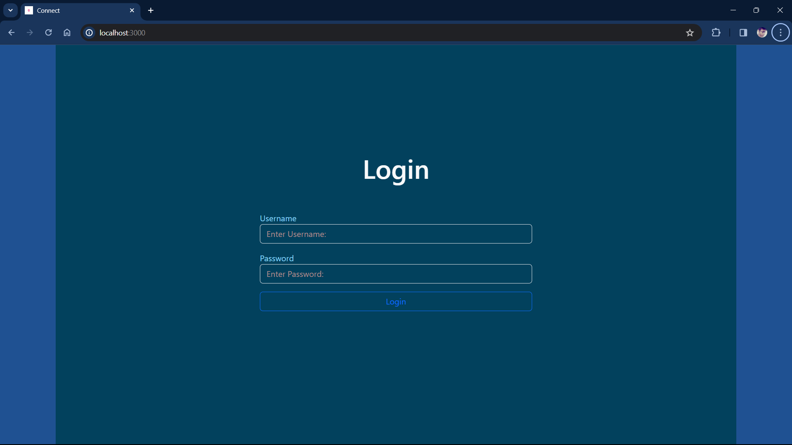
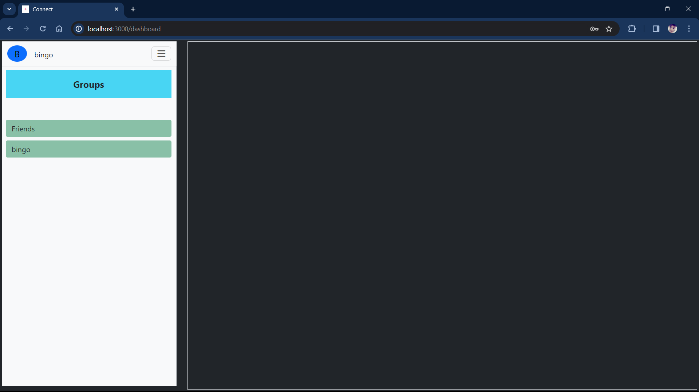
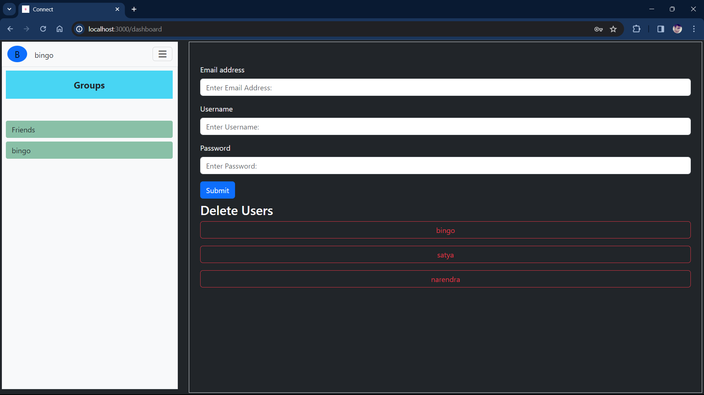
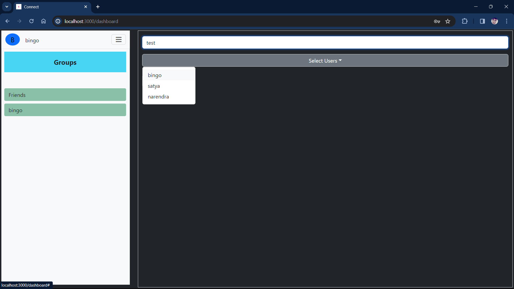
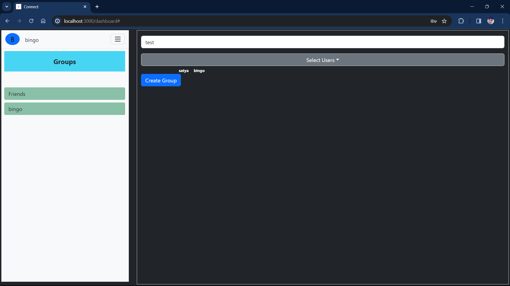
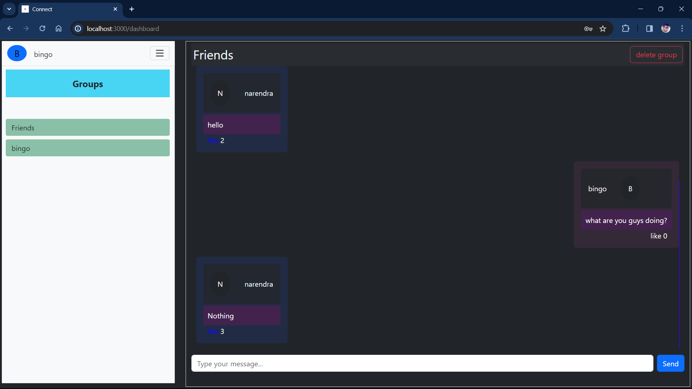

# Messaging Web Application

Welcome to the Messaging Web Application, a project created by Narendra.

## Overview

This application is designed to provide a messaging platform with a frontend built using React and a backend powered by Django Rest Framework.

## Screenshots

Here are some screenshots showcasing the views of the application:

### 1. *login*
   

### 2. *dashboard*
   

### 3. *create and delete users*
   

### 4. *search users and select and create group*
   


### 5. *selected users*
   

### 5. *chat messages and likes*
   


## Setup Instructions

To set up and run the application locally, follow these steps:

### Frontend (React)

1. Navigate to the `frontend` directory:

    ```bash
    cd frontend
    ```

2. Install dependencies:

    ```bash
    npm install
    ```

3. Run the development server:

    ```bash
    npm run dev # for local run
    ```

   The application will be accessible at `http://localhost:3000`.

### Backend (Django Rest Framework)

1. Create a virtual environment (recommended):

    ```bash
    python -m venv venv
2. Activate the virtual environment:

    - On Windows:

        ```bash
        venv\Scripts\activate
        ```

    - On macOS/Linux:

        ```bash
        source venv/bin/activate
        ```

3. Install dependencies:

    ```bash
    pip install -r requirements.txt
    ```


4. Navigate to the `backend` directory:

    ```bash
    cd backend
    ```

5. Apply migrations:

    ```bash
    python manage.py makemigrations
    python manage.py migrate
    # create a admin user from admin page by creating super user in django admin pannel and perform actions
    python manage.py createsuperuser <user>
    # login and perform actions
    ```

6. Run the development server:

    ```bash
    python manage.py runserver
    ```

   The backend will be accessible at `http://localhost:8000`.

    Now, you should have both the frontend and backend servers running locally. Open your web browser and go to `http://localhost:3000` to access the messaging application.    

7. Run Test Cases:

    ```bash
    python manage.py test
    ```
